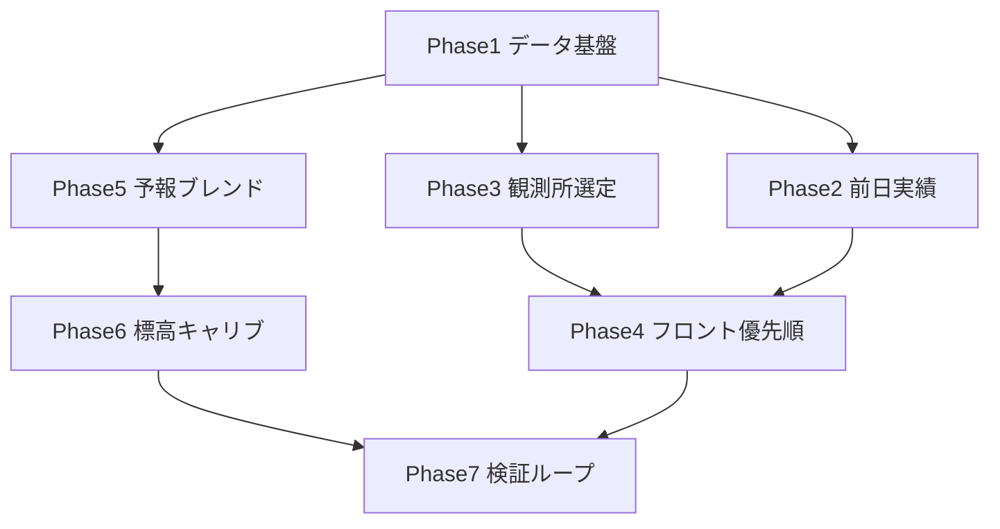

# 積雪・降雪精度向上 — 実装手順・指示書

**対象**: implementer エージェント / 人間実装者  
**前提**: 前回提案のうち **ゲレンデ公表値（`resort-snow.json` / `RESORTS.snowDepth`）はスコープ外**  
**作成日**: 2026-06-22

---

## 0. スコープ定義

### 実装する

| # | 施策 | 主な成果物 |
|---|------|-----------|
| 1 | 気象庁データの毎時自動更新 | `.github/workflows/update-jma-snow.yml` |
| 2 | アメダス全件 + 観測所 overrides | `data/amedas-stations.json`, `data/jma-station-overrides.json` |
| 3 | 観測所選定の標高考慮 | `scripts/fetch-jma-snow.js` |
| 4 | 前日時間別実績の生成 | `scripts/fetch-jma-prevday-hourly.js`, `data/jma-prevday-hourly.json` |
| 5 | ゲレンデ公表を使わない表示優先順 | `ski-powder-hunter.html`, `ski-powder-hunter-en.html` |
| 6 | 観測がある日はモデル積雪深を出さない | 同上 |
| 7 | 短期予報 = JMA メッシュ優先 | 同上 + 必要なら `scripts/` |
| 8 | 自前 API の本番利用 | `api/`, デプロイ設定, HTML の `SNOW_API_BASE` |
| 9 | 標高補正のキャリブレーション | `data/elevation-snow-factors.json`, HTML |
| 10 | 降水→雪換算ルールの統一 | HTML |
| 11 | 近隣フォールバックの改善 | HTML |
| 12 | 精度検証スクリプト | `scripts/validate-snow-accuracy.js` |

### 実装しない（明示除外）

- `resort-snow.json` の手動/スクレイプ更新
- ゲレンデ公式サイトからの積雪取得
- `RESORTS.snowDepth` のメンテナンス・優先利用

### 受け入れの共通原則

- JP / EN の **両 HTML** を同内容で変更
- データソースは UI で明示（既存の `sourceLabel` パターンを維持）
- 観測値と予報値を混同しない（ラベル・tooltip）
- 変更後: `node scripts/count-jma-coverage.js` でカバレッジ確認

---

## 1. 実装フェーズと依存関係



**推奨順**: Phase 1 → 2 → 3 → 4 → 5 → 6 → 7  
Phase 5（API）はインフラが別途必要なら Phase 4 の後に並行可。

---

## Phase 1 — データ基盤（気象庁毎時 + アメダス全件）

### 1-1. `amedas-stations.json` を全観測所に拡張

**指示**

1. [LANDWATCH アメダス一覧](https://landwatch.info/topic/ame-code/) 等から CSV を取得
2. 形式を維持: `{ "観測所番号": { "lat", "lng", "name" }, ... }`
3. 積雪 CSV に出るが座標が無い観測所は手動追記（`docs/気象庁積雪データの紐づけ.md` 参照）

**検証**

```bash
node scripts/fetch-jma-snow.js
node scripts/count-jma-coverage.js
node scripts/count-jma-distance.js
```

**合格基準**: JMA 紐づき件数が Phase 1 前より増加、`dist_km >= 80` の件数が減少

---

### 1-2. GitHub Actions: 気象庁データ毎時更新

**新規**: `.github/workflows/update-jma-snow.yml`

**仕様**

- cron: `55 * * * *`（UTC では JST 毎時55分相当 — `update-weather.yml` と同様 `TZ: Asia/Tokyo` を job に設定）
- 実行: `node scripts/fetch-jma-snow.js`
- コミット対象: `data/jma-snow.json` のみ
- コミットメッセージ例: `chore: update JMA snow cache [automated]`

**既存 `update-weather.yml` との関係**: 別 workflow のまま（1 job にまとめない。失敗の切り分けを容易にする）

**検証**: Actions 手動実行 → `jma-snow.json` の `observed_at` が更新されること

---

### 1-3. `jma-station-overrides.json` の整備

**現状**: `{}`（空）

**指示**

1. `node scripts/debug-jma-distance.js`（閾値 200km）と `count-jma-distance.js` で問題ゲレンデを洗い出す
2. 標高差が大きい・谷の観測所が選ばれているゲレンデを手動で overrides
3. 形式: `{ "リゾートID": "観測所番号", ... }`（`fetch-jma-snow.js` 既存対応）

**目安**: 主要50ゲレンデについて overrides を最低1周レビュー

---

## Phase 2 — 前日時間別実績（`jma-prevday-hourly.json`）

**現状**: スキーマのみ定義、`data/README.md` に記載。生成スクリプト未実装。

### 2-1. 新規スクリプト `scripts/fetch-jma-prevday-hourly.js`

**出力形式**（`data/README.md` 準拠）:

```json
{
  "calendar_day_jst": "2026-03-21",
  "rule_note_ja": "（JMA_PREV_SNOW_RULE_TITLE_JA と同一で可）",
  "rule_note_en": "…",
  "stations": {
    "16217": {
      "precip_mm": [/* 24要素 JST 0-23時 */],
      "temp_c": [/* 24要素 */]
    }
  }
}
```

**取得方針（implementer が実装）**

- 対象日 = **JST での「昨日」**（カレンダー日 0:00–23:59）
- 対象観測所 = `jma-snow.json` に登場する `station_no` のユニーク集合（全450件分を毎回取らない）
- データ源候補（優先順）:
  1. 気象庁アメダス時系列（1時間降水量・気温）— [気象庁データサイト](https://www.data.jma.go.jp/) / opendataapi 等
  2. 取得不可時間は `null` ではなく **その時間帯合計を出さない**（HTML 側は既に `sumJmaPrevSnowHourly` が null でスキップ）

**換算ルール**: 既存 `jmaHourlyPrecipTempToSnowCm` と **同一式**（Phase 6 で統一後は定数を共有）

### 2-2. GitHub Actions 連携

**新規または既存 workflow に追加**

- 毎日 **JST 1:10** 頃（前日が確定してから）: `node scripts/fetch-jma-prevday-hourly.js`
- コミット: `data/jma-prevday-hourly.json`

### 2-3. 検証

1. ローカルでスクリプト実行
2. ブラウザで HTML 読み込み → 「前日合計（気象庁）」チップが表示されるゲレンデがあること
3. Open-Meteo の昨日値と **一致しない** こと（気象庁系のみ使用の確認）

---

## Phase 3 — 観測所選定の改善（`fetch-jma-snow.js`）

**現状**: Haversine 最短距離のみ。`MAX_STATION_DISTANCE_KM = 80`。

### 3-1. 標高差ペナルティの導入

**変更ファイル**: `scripts/fetch-jma-snow.js`

**ロジック案**（最小差分）:

```
effectiveDist = haversineKm + elevationPenalty
elevationPenalty = max(0, |resort.elevation.top - stationElev|) * PENALTY_PER_M
```

- `stationElev`: `amedas-stations.json` に `elev` を追加（無い場合 0 または推定）
- 定数初期値: `PENALTY_PER_M = 0.002`（500m差 → +1km 相当）
- `jma-station-overrides.json` 指定時は従来どおり overrides 優先

### 3-2. 出力の拡張

各エントリに optional で追加:

```json
{
  "dist_km": 12.3,
  "elev_diff_m": 450,
  "selection_score": 13.2
}
```

（デバッグ・検証用。フロント必須ではない）

### 3-3. 検証

```bash
node scripts/fetch-jma-snow.js
node scripts/debug-jma-distance.js
```

谷の観測所より山側が選ばれるケースが増えていること。

---

## Phase 4 — フロント: 公表値除外 + 観測/予報の分離

**変更ファイル**: `ski-powder-hunter.html`, `ski-powder-hunter-en.html`

### 4-1. ゲレンデ公表パスを無効化

**対象関数**

- `getDisplaySnowDepth`
- `getDepthForRanking`

**指示**

1. 先頭の `resortSnowCache` / `resort.snowDepth` 分岐を **削除** または定数ガード:

```javascript
const USE_RESORT_PUBLISHED_SNOW = false; // 精度改善フェーズでは false 固定
```

2. 新優先順位:
   - **積雪表示**: 気象庁 `jma.depth_cm` → モデル `hourly_snow_depth[0]`
   - **積雪ランキング**: 気象庁 `depth_max_today_cm` ?? `depth_cm` → モデル

3. `resort-snow.json` の fetch は **残してよい**（将来用）が、上記 false なら参照しない

4. `data/resort-snow.json` 読み込み UI 文言から「公表優先」の記述があれば削除

### 4-2. モデル積雪深の抑制

**ルール**: `jma.depth_cm != null` または `jma.depth_max_today_cm != null` のゲレンデでは、`hourly_snow_depth` を **積雪表示に使わない**（予報降雪とは別物のため）

### 4-3. ソースラベル

| 条件 | JP label | EN label |
|------|----------|----------|
| 気象庁 | 近隣気象庁観測値 | Nearby JMA observation |
| モデル | モデル推定 | Model estimate |
| 近隣フォールバック（降雪） | 近隣ゲレンデ推定 | Nearby resort estimate |

---

## Phase 5 — 予報精度（短期 JMA + 自前 API）

### 5-1. 短期: JMA メッシュを数値予報に統合

**現状**: JMA 3h/6h はマップタイル表示のみ（`buildJmaSnowTileUrl`）。

**指示（段階実装）**

**5-1a. MVP（推奨・先にやる）**

- `getSnowfallForDisplay(resortId, dayOffset)` を拡張
- `dayOffset === 0`（今日）かつ JMA 3h/6h メッシュから resort 座標の **推定降雪 cm** が取れる場合:
  - 日次 `snowfall_sum[今日]` の代わりに、**メッシュ由来の残り時間降雪 + 既降分（jma snowfall_3h/24h 観測）** を合成
- メッシュ PNG → cm 換算:
  - 気象庁 jmatile の色標に従うルックアップテーブルを `scripts/` または HTML 内定数で定義
  - 実装前に **1地点・1時刻** で既知値と照合（手動スポットチェック必須）

**5-1b. 将来**

- サーバー側でタイルを読み座標補間（CORS/負荷対策）

**フォールバック**: メッシュ取得失敗時は現行 Open-Meteo + `elevationFactor` のまま

---

### 5-2. 自前 API の本番化

**参照**: `api/README.md`, `api/main.py`

**インフラ指示**

1. `api/` を VPS / Cloud Run 等にデプロイ
2. 環境変数:
   - `WEATHERAPI_KEY`（任意・アンサンブル）
   - `JMA_SNOW_GRIB2`（任意・GRIB2 パス）
3. 1時間ごとに全ゲレンデ座標を `/api/forecast` でウォーム（cron または `scripts/warm-snow-api.js` 新規）

**フロント**

```javascript
const SNOW_API_BASE = "https://（本番APIドメイン）";
```

- 本番 HTML では **空文字に戻さない**（429 回避）
- ローカル開発のみ `""` または `http://localhost:8000`

**5-2a. `jma_grib2.py` の GRIB2 対応強化**

現状は 7日同一値のスタブに近い。配信仕様に合わせ:

- 時間次元ごとの日次積算
- 最近傍 → 双線形補間

---

### 5-3. `fetch-weather-hourly.js` の改善（API 未使用時の保険）

**指示**

- 既に `elevation=${r.elevation.top}` を付与済み — 維持
- Phase 9 のキャリブレーション後、`processApiResponse` 出力に `elevationFactor` 適用を **サーバー側キャッシュ** で行うか検討（HTML と二重適用しない）

---

## Phase 6 — 標高補正 + 降水→雪ルール統一

### 6-1. 換算ルールの統一

**現状の不一致**

| 用途 | 閾値 |
|------|------|
| `jmaHourlyPrecipTempToSnowCm` | 4℃ / 0℃ 線形 |
| `classifyPhase` | 0 / 1.5 / 2.5℃ |

**指示**

1. 共通定数オブジェクト `SNOW_PHASE_THRESHOLDS` を HTML 先頭付近に1つ定義
2. 両関数から参照
3. 初期値は **jma 系（4℃）に揃える**（前日実績と整合）

### 6-2. 標高補正キャリブレーション

**新規**: `data/elevation-snow-factors.json`

```json
{
  "default": { "base_m": 500, "factor_per_m": 0.00025, "max": 1.5 },
  "by_region": {
    "hokkaido": { "factor_per_m": 0.0003, "max": 1.6 }
  },
  "by_resort_id": {
    "45": { "factor": 1.35 }
  }
}
```

**`elevationFactor(resort)` 変更**

1. `by_resort_id` → `by_region`（`resort.region`）→ `default` の順でマージ
2. 既存式は `default` に退避

**係数の決め方**: Phase 7 の検証結果から手動更新（自動学習はスコープ外）

---

## Phase 7 — 近隣フォールバック改善

**現状**（`getSnowfallForDisplay`）:

- 自地点 `< 5cm` → 5km 以内で最大値を借用
- 標高・向きは未考慮

**指示**

1. 定数追加:

```javascript
const NEARBY_FALLBACK_MAX_ELEV_DIFF_M = 400;
const NEARBY_FALLBACK_MAX_SCORE = ... // dist_km + elev_penalty
```

2. 借用候補のスコア:

```
score = haversineKm + |Δelev| * 0.003
```

3. `fromNearby: true` の tooltip に「近隣（○km・標高差△m）」を表示

4. 気象庁 `snowfall_24h_cm` がある場合は **近隣借用より観測を優先**

---

## Phase 8 — 精度検証ループ

### 8-1. 新規 `scripts/validate-snow-accuracy.js`

**入力**

- `data/weather.json`（または Open-Meteo 再取得）の **昨日予報** snowfall
- `data/jma-snow.json` の `snowfall_24h_cm`（実績）

**出力**

- `reports/snow-accuracy-YYYY-MM-DD.json`
- コンソール要約: 全体 MAE / 地域別 MAE / 上位10乖離ゲレンデ

**実行**: 毎日 JMA 更新後（Phase 1 workflow の末尾 step でも可）

### 8-2. 受け入れ基準（初回ベースライン）

- レポートが生成されること
- 乖離 Top10 から overrides / 標高係数の修正候補がリストアップできること
- **数値目標は初回計測後に設定**（いきなり MAE ○cm 以下は要求しない）

### 8-3. `boundary-tests.md` 更新

`.claude/agents/snow-data/boundary-tests.md` に最低限:

- 気象庁あり / なしゲレンデ
- 前日 hourly 24本欠損
- dayOffset 0 で JMA メッシュあり/なし
- `USE_RESORT_PUBLISHED_SNOW = false` 時の表示

---

## 9. デプロイ・運用チェックリスト

### 本番 `data/` に必要なファイル

| ファイル | 更新頻度 |
|----------|----------|
| `jma-snow.json` | 毎時 |
| `jma-prevday-hourly.json` | 毎日 |
| `weather.json` | 毎時（既存） |
| `amedas-stations.json` | 随時 |
| `jma-station-overrides.json` | 随時 |
| `elevation-snow-factors.json` | 検証後随時 |

### デプロイ後確認 URL

```
https://（本番）/data/jma-snow.json
https://（本番）/data/jma-prevday-hourly.json
```

### ブラウザ確認（手動）

1. 積雪表示に「ゲレンデ公表」が **出ない**
2. 気象庁紐づきゲレンデで「近隣気象庁観測値」
3. 「前日合計（気象庁）」チップ（データあり時）
4. 降雪ランキングが空にならない（API or cache 正常時）
5. EN 版も同等

---

## 10. implementer への依頼テンプレート

各 Phase を implementer スレッドに投げるとき:

```
ROLE: implementer
このスレッドは implementer として対応してください。

Phase N を実装して。
指示書: docs/IMPLEMENTATION_ORDER_SNOW_ACCURACY.md の Phase N 節
除外: ゲレンデ公表値（resort-snow）関連は触らない
完了条件: 同節の「検証」「合格基準」を満たすこと
```

**推奨分割**（1 PR = 1 Phase、Phase 4+5 は HTML 変更が重なるので Phase 4 完了後に 5）

---

## 11. リスクとフォールバック

| リスク | 対策 |
|--------|------|
| 気象庁 CSV / アメダス API 変更 | スクリプト失敗時は前回 JSON を残す（workflow で diff 空なら commit スキップ） |
| JMA メッシュ PNG→cm 換算が不正確 | MVP は「今日のみ」+ ラベル「メッシュ推定」+ 失敗時 Open-Meteo |
| 自前 API 未デプロイ | `SNOW_API_BASE=""` + `weather.json` キャッシュで継続 |
| overrides 整備が追いつかない | Phase 3 の標高ペナルティで暫定改善 |

---

## 12. 工数目安

| Phase | 目安 |
|-------|------|
| 1 データ基盤 | 0.5–1日 |
| 2 前日 hourly | 1–2日（API 調査含む） |
| 3 観測所選定 | 0.5日 |
| 4 フロント優先順 | 0.5日 |
| 5 予報（5-1a MVP） | 1–2日 |
| 5 API 本番 | インフラ依存 1–3日 |
| 6 ルール統一 + 係数 | 0.5日 |
| 7 近隣 FB | 0.5日 |
| 8 検証 | 0.5–1日 |

**合計**: 約 5–9 人日（API・メッシュ MVP の深さによる）

---

## 関連ドキュメント

- `docs/気象庁積雪データの紐づけ.md`
- `data/README.md`
- `api/README.md`
- `docs/AGENT_HANDOFF_JMA_SNOW_AND_RANKING_2026-03.md`
