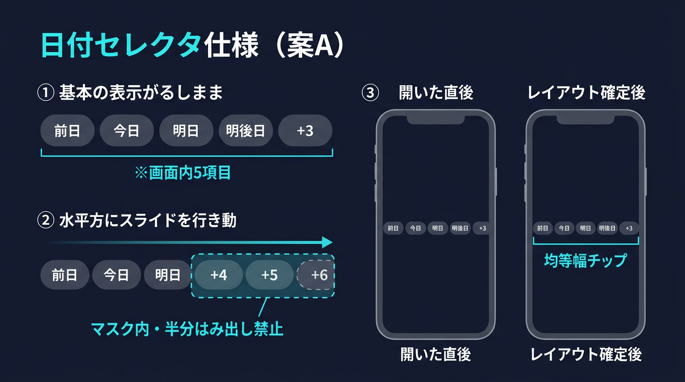
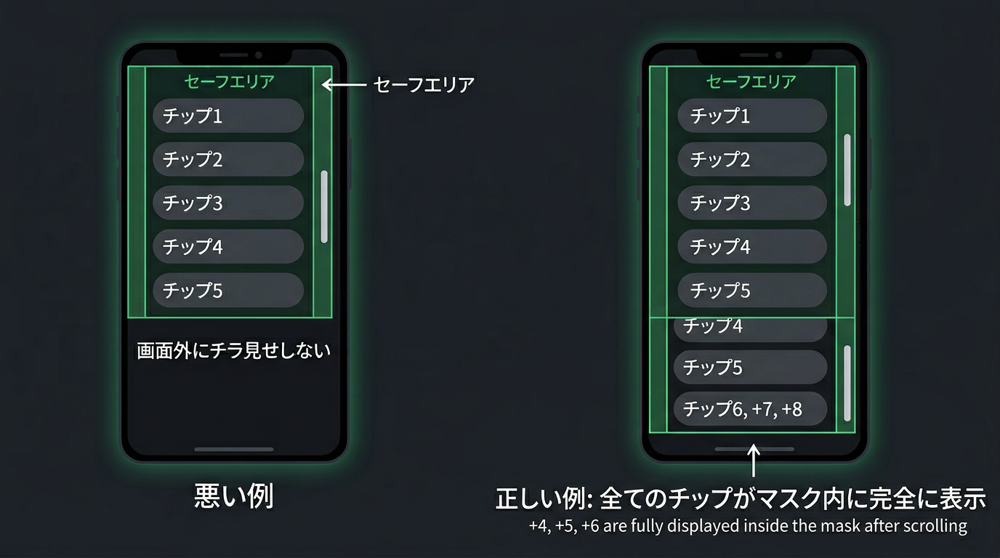

# モバイル版 UI 修正プロジェクト（実装ブック No.1〜11）

**固定表示（番号リスト・チェック・図・次タスク）**: [`FIXED_ROADMAP_9ecbfe76.md`](FIXED_ROADMAP_9ecbfe76.md)（参照 ID: `9ecbfe76-6c54-47e6-abab-631b053f20c1`）

**実装の監査・指示との照合ログ**: [`IMPLEMENTATION_AUDIT_LOG.md`](IMPLEMENTATION_AUDIT_LOG.md)（更新のたびにエントリ追加）

## 0. この文書の読み方

- **No.1 → No.11 をこの順で実施する。** 番号は依存関係付きの推奨順。
- 各項目に **やること**・**世界最高峰UIの到達点**・**副作用と追従対応** を書いてある。**順番を飛ばすと手戻りが増える。**
- **対象ファイル**: `ski-powder-hunter.html` / `ski-powder-hunter-en.html`（**JP / EN 同順・同内容**で直す）
- **ブレークポイント**: 特記なき限りモバイルは **`max-width: 700px`**（既存と同じ）

### 0.1 「世界最高峰UI」チェック（プロジェクト共通の品質バー）

実装のたびに、次を**悪化させていないか**確認する。

| 観点 | 基準 |
|------|------|
| **可読性** | 主要数値・日付が **切れない**（極小フォントだけに頼らない） |
| **到達性** | 主要操作のタップ領域 **目安 40px 以上**（可能なら 44px 近傍） |
| **一貫性** | 同じ意味の色・ラベルが **JP/EN で同じ情報構造** |
| **階層** | 1画面で「何が主役か」が **色・サイズ・位置**で分かる |
| **誠実さ** | データの出典・性質（実測/予測/JMAメッシュ等）が **短く分かる** |
| **アクセシビリティ** | コントラスト・フォーカス・誤解を招く色使いを避ける |

---

## 1. 進捗一覧（No.1〜11）

| No | ID | 短い名前 | 状態 |
|----|-----|----------|------|
| 1 | A-1 | 日付セレクタ（案A・5可視＋スライド） | ✅ 指示書確定／⬜ コード反映は別 |
| 2 | A-2 | タイポ・コントラスト（トークン） | ✅ |
| 3 | B-1 | 地図フロートのグリッド揃え | ✅ |
| 4 | B-2 | 地図クローム2段の仕様適合 | ✅ |
| 5 | B-3 | JMA降雪トグル文言・注記 | ✅ |
| 6 | B-4 | マップピン・ラベルの可読性・タップ | ✅ |
| 7 | C-1 | ランキングスコアの意味・単位 | ⬜ |
| 8 | C-2 | ランキングスコア色の意味 | ⬜ |
| 9 | C-3 | ランキングカードのスキャン性 | ⬜ |
| 10 | D-1 | ブランドとUIフォントの方針 | ⬜ |
| 11 | D-2 | ヘッダー・ナビの言語一貫（EN） | ⬜ |

**任意（本番ロードマップ外）**: E-1 地図操作のボトムシート化 → `§5` 参照。

---

### 1.1 完了チェック（短いリスト）

**記入**: 完了したら `完了` 列の `[ ]` を `[x]` にする。

| No | ID | 項目 | 完了 |
|:--:|:--:|------|:----:|
| 1a | A-1 | 日付セレクタ・案A（**指示書**） | [x] |
| 1b | A-1 | 日付セレクタ・案A（**コード**） | [ ] |
| 2 | A-2 | タイポ・コントラスト | [x] |
| 3 | B-1 | 地図フロートのグリッド揃え | [x] |
| 4 | B-2 | 地図クローム2段 | [x] |
| 5 | B-3 | JMA降雪トグル文言・注記 | [x] |
| 6 | B-4 | マップピン可読性・タップ | [x] |
| 7 | C-1 | ランキングスコアの意味・単位 | [ ] |
| 8 | C-2 | ランキングスコア色 | [ ] |
| 9 | C-3 | ランキングカードのスキャン性 | [ ] |
| 10 | D-1 | ブランドとUIフォント方針 | [ ] |
| 11 | D-2 | ENヘッダー・ナビ統一 | [ ] |
| （任意） | E-1 | 地図ボトムシート化 | [ ] |

※ 各項目の詳細は **§4**。**No.1 案A**の実装手順は **`IMPLEMENTATION_ORDER_DATE_SELECTOR_5_SLIDE_OPTION_A.md`**。

### 1.2 No.1 案Aのビジュアル（理解確認用・併記）

`docs/mobile-ux-images/` に置いたコンセプト図。**5可視＋スライド・はみ出し禁止・開いた直後→レイアウト確定**の対応関係。

| 図 | ファイル |
|----|----------|
| 5項目・スライド・開閉のイメージ | `spec-date-selector-5items-slide-visualization.png` |
| マスク内スライド・端のチラ見せ禁止 | `spec-date-selector-no-peek-overflow.png` |

---

## 2. 関連ドキュメント（正本）

| 内容 | ファイル |
|------|----------|
| 日付案Aの実装手順・受け入れ | **`IMPLEMENTATION_ORDER_DATE_SELECTOR_5_SLIDE_OPTION_A.md`** |
| 地図・下段8マス・データ分岐 | **`IMPLEMENTATION_ORDER_MOBILE_MAP_UNIFIED.md`** |
| JMAトグル文言 | **`IMPLEMENTATION_ORDER_JMA_SNOW_TOGGLE_LABELS.md`** |
| コンセプト図 | **`docs/mobile-ux-images/`** |

---

## 3. 原則（全体）

| # | 原則 |
|---|------|
| P1 | **JP / EN 同順・同構造**で完了にする |
| P2 | データ仕様は **`IMPLEMENTATION_ORDER_MOBILE_MAP_UNIFIED.md`**。上段日付の**レイアウト**は **`IMPLEMENTATION_ORDER_DATE_SELECTOR_5_SLIDE_OPTION_A.md`** が優先 |
| P3 | 変更で **タッチ領域・コントラスト**を落とさない |
| P4 | **No.n を終えるたび**に、その項目の受け入れと **副作用の有無** をメモする |

---

## 4. 順序どおりの実装ブック（No.1〜11）

以下、**この順に**読み、実装し、チェックする。

---

### No.1 — A-1 `mobile-date-readable`（日付セレクタ・案A）

| 項目 | 内容 |
|------|------|
| **問題** | 8列を無理に詰めると **日付が切れる**（例: `03/` のみ）→ **日付という最優先情報が失敗**する。 |
| **やること** | **`IMPLEMENTATION_ORDER_DATE_SELECTOR_5_SLIDE_OPTION_A.md` どおり**実装。**≤700px**: ビューポートに **5チップ分**（前日〜+3）、**+4〜+6** は **横スクロール＋スナップ**。**>700px**: **8列グリッド**維持。`明後日` ラベル、`ensureActiveDateVisible`（+4〜+6 選択時にチップが画面内へ）。 |
| **世界最高峰UIで達する状態** | **「どの日のデータか」が常に誤読なく読める**（Apple HIG / Material の *clear hierarchy for primary task* に相当）。 |
| **完了条件（コード）** | 同指示書 **§8 受け入れ条件**を満たす（JP/EN）。 |
| **いまの進捗** | **実装指示書・統合ドキュメント整合は完了。** アプリへのコードは **未反映なら ⬜**。 |
| **副作用・追従対応** | ① **下段8マス**との横位置の見え方が変わる → 必要なら **同じ `padding-inline`** で揃える。② **ポップアップ内の日タブ**（別 UI）と **ラベル・挙動の一貫**を確認。③ **横スクロール導入**で誤って **下段だけ** `overflow-x:auto` にしない（統合書の失格条件に注意）。④ 再描画後 **`scrollLeft` のリセット**で選択日が見えなくならないか確認。⑤ **§3.2**（**JMA と日付ビューポートをモバイルで横並びにしない**）— 前日JMAチップ表示時も **日付ビューポートが全幅**になること。`IMPLEMENTATION_ORDER_DATE_SELECTOR_5_SLIDE_OPTION_A.md` **§3.2**・**§8** 受け入れ。 |

---

### No.2 — A-2 `mobile-typography-tokens`（タイポ・コントラスト）

| 項目 | 内容 |
|------|------|
| **問題** | `--text-dim` 等が薄く、**屋外・逆光**でメタ情報が読めない。 |
| **やること** | モバイル用に **補助テキストのコントラストを一段上げる**、または **補助ラベルだけ 1px アップ**。`:root` のトークンか `@media (max-width:700px)` 上書きで **局所化**。 |
| **世界最高峰UIで達する状態** | **主要でない情報も「読もうとすれば読める」**（WCAG を完全クリアでなくても、**意図的な階層**は維持）。 |
| **完了条件** | トップ・地図・リストで **補助文が同じ階層で統一**され、No.1 の日付チップと **競合しない**。 |
| **副作用・追従対応** | ① フォントサイズアップで **カード高さ・改行**が増える → **C-3** 前にレイアウトを確認。② コントラストを上げすぎると **アクセント色の差**が小さく見える → **C-2** の色設計と **あわせて調整**する可能性。 |

---

### No.3 — B-1 `map-float-grid`（地図フロートのグリッド揃え）

| 項目 | 内容 |
|------|------|
| **問題** | 「戻る」「検索」「JMA」の **幅・左右が揃わず**、安っぽく見える。 |
| **やること** | **同一の左右マージン（セーフエリア含む）** のラッパーで **3要素を包む**、または **1カラムで内側幅を統一**。 |
| **世界最高峰UIで達する状態** | **地図上の OS 風コントロールが「同じデザインシステム」**に見える（整列＝信頼）。 |
| **完了条件** | ≤700px で **左端・右端が視覚的に一直線**（スクショで確認）。 |
| **副作用・追従対応** | ① **JMA の高さ**が変わると **地図クリック可能領域**の体感が変わる → **B-2** と合わせて **地図のタップ阻害がないか**確認。② ラッパー追加で **z-index** がずれる → ポップアップ・検索の重なり順を確認。 |

---

### No.4 — B-2 `map-chrome-two-rows`（地図クローム2段）

| 項目 | 内容 |
|------|------|
| **問題** | 地図が **操作 UI に隠れすぎる**／統合指示書と **段数・凡例**がずれる。 |
| **やること** | **`IMPLEMENTATION_ORDER_MOBILE_MAP_UNIFIED.md` §2** どおり：**1段目＝戻る＋検索**、**2段目＝JMA**。**常時凡例パネルは出さない**。 |
| **世界最高峰UIで達する状態** | **地図が主役**（情報レイヤは最小限）。 |
| **完了条件** | 仕様書の **失格条件**に触れない（不要な常時オーバーレイなし）。 |
| **副作用・追従対応** | ① **B-1** の余白と合わせて **地図の有効高さ**を再確認。② 詳細シート表示時の **visibility** 挙動（既存）を壊さない。 |

---

### No.5 — B-3 `jma-labels-footnote`（JMA降雪トグル）

| 項目 | 内容 |
|------|------|
| **問題** | 「3h/6h」が **何のデータか**一文で説明されないと誤解が生じる。 |
| **やること** | **`IMPLEMENTATION_ORDER_JMA_SNOW_TOGGLE_LABELS.md`** どおり（**今後3h / Next 3h**、注記行）。 |
| **世界最高峰UIで達する状態** | **データの出自・性質が一言で誠実に分かる**（プロダクトの信頼性）。 |
| **完了条件** | JP/EN で **文言・注記・title** が指示どおり。 |
| **副作用・追従対応** | ① **B-1** の縦積みで **JMA の高さ増** → 地図上端の **安全余白**を再確認。② `value` は **`3h`/`6h` のまま**（既存 URL 生成を壊さない）。 |

---

### No.6 — B-4 `map-marker-touch-readability`（マップピン）

| 項目 | 内容 |
|------|------|
| **問題** | ピン上の **cm 表示が小さく**、**誤タップ・誤読**が起きる。 |
| **やること** | マーカー用クラスで **font-size / padding** を上げる、**最小タップ領域**を確保。必要なら **選択中のみ** ラベル拡大。 |
| **世界最高峰UIで達する状態** | **地図上の主要記号が「タッチ可能なコントロール」として認識できる**。 |
| **完了条件** | 実機で **指で押しやすい**、数値が **読める**（スクショ＋自己申告）。 |
| **副作用・追従対応** | ① ラベル肥大で **クラスタと重なる** → Leaflet の **オフセット / クラスタ閾値**を確認。② **詳細シート**の数値との **一貫性**（単位・丸め）。 |

---

### No.7 — C-1 `ranking-score-meaning`（スコアの意味）

| 項目 | 内容 |
|------|------|
| **問題** | 大きな数字だけでは **何のスコアか**分からず、**色の意味も読めない**。 |
| **やること** | スコア横に **`/100`** 等、または **小見出し「パウダー期待」**、ツールチップ。 |
| **世界最高峰UIで達する状態** | **初見で指標の定義が分かる**（ダッシュボードの *labeled metrics*）。 |
| **完了条件** | 初見ユーザーが **数値の意味を言語化できる**（簡易ユーザテスト or チームレビュー）。 |
| **副作用・追従対応** | ① 文言追加で **カード幅**が詰まる → **C-3** のレイアウトと **まとめて調整**。② **C-2** の色と **セットで見たときに矛盾がないか**。 |

---

### No.8 — C-2 `ranking-score-color`（スコアの色）

| 項目 | 内容 |
|------|------|
| **問題** | **赤＝低期待**は、**危険・怒り**の連想で誤解されやすい。 |
| **やること** | **低〜中: ニュートラル〜琥珀**、**高期待のみアクセント**など、**意味と色を設計**して適用。 |
| **世界最高峰UIで達する状態** | **色が感情と指標を一致させる**（セマンティックカラーの一貫性）。 |
| **完了条件** | 色と **「期待薄/高」等の文言**が矛盾しない（JP/EN）。 |
| **副作用・追従対応** | ① **他画面の赤**（エラー等）と **混同しないか**。② **A-2** のテキスト色と **競合しないか**。 |

---

### No.9 — C-3 `ranking-card-scan`（ランキングカードのスキャン性）

| 項目 | 内容 |
|------|------|
| **問題** | アイコン・短文が詰まり **F字型のスキャン**がしづらい。 |
| **やること** | **1行サマリ**（積雪・風・気温）を優先、詳細は **折りたたみ** または **2行目**。 |
| **世界最高峰UIで達する状態** | **上から下に「比較判断」ができる**（リスト UI の王道）。 |
| **完了条件** | 主要情報が **同じ位置に揃い**、視線移動が少ない。 |
| **副作用・追従対応** | ① **No.7〜8** のラベル・色と **干渉**しないよう余白調整。② **行高変更**でトップヒーローとの **バランス**を確認。 |

---

### No.10 — D-1 `brand-font-strategy`（ブランドとUIフォント）

| 項目 | 内容 |
|------|------|
| **問題** | ロゴ（セリフ）と UI（サンセリフ）の関係が **意図不明**に見える。 |
| **やること** | **`docs/` に1行方針**（意図的ミックス **か** UI 一本化 **か**）。後者なら **見出しだけ**段階的に統一。 |
| **世界最高峰UIで達する状態** | **タイポグラフィが「ブランドの意図」を語る**。 |
| **完了条件** | 方針文書がリポジトリにあり、**新規 UI が迷わない**。 |
| **副作用・追従対応** | フォント変更は **読み込み・FOUT** に影響 → **パフォーマンス確認**。 |

---

### No.11 — D-2 `i18n-header-nav`（EN のナビ表記）

| 項目 | 内容 |
|------|------|
| **問題** | **EN 画面に日本語「トップ」**など、**言語と UI 文言が混在**。 |
| **やること** | EN では **Home / Ranking** 等に **統一**（ヘッダー・戻る・必要なら `aria-label`）。 |
| **世界最高峰UIで達する状態** | **言語切替が「翻訳」ではなく「ロケール一式の切替」**に見える。 |
| **完了条件** | EN ページを **日本語が混ざらず**通読できる。 |
| **副作用・追従対応** | 文言変更で **レイアウト幅**が変わる → **ヘッダー折り返し**を確認。 |

---

## 5. 任意フェーズ E-1（本ロードマップ外）

| 項目 | 内容 |
|------|------|
| **内容** | 地図操作を **ボトムシート / 下部バー**へ寄せる（親指到達域）。 |
| **注意** | **`IMPLEMENTATION_ORDER_MOBILE_MAP_UNIFIED.md` の「2段クローム」と競合しうる**ため、**仕様変更プロトコル**（ドキュメント更新）が必要。 |
| **推奨** | **No.1〜11 とデータ正本が安定してから**別イテレーションで検討。 |

---

## 6. 推奨スプリント分割（目安）

| スプリント | No | メモ |
|------------|-----|------|
| **S1** | 1, 2 | 日付・全体タイポ（ユーザー影響大） |
| **S2** | 3, 4, 5 | 地図クローム＋JMA文言 |
| **S3** | 6 | ピン |
| **S4** | 7, 8, 9 | ランキングカード一式 |
| **S5** | 10, 11 | 方針・i18n仕上げ |

---

## 7. プロジェクト全体の完了条件

- [ ] **§1.1 の表**で、1b〜11 がすべて `[x]`（任意 E-1 は不要）
- [ ] **No.1〜11** の **副作用の追従**が記録されている（各Noでメモ可）
- [ ] JP / EN **同レベル**
- [ ] `IMPLEMENTATION_ORDER_MOBILE_MAP_UNIFIED.md` の **失格条件**に該当しない

---

## 8. 変更履歴

| 日付 | 内容 |
|------|------|
| 2025-03-17 | 初版 |
| 2025-03-17 | 進捗表・詳細表 |
| 2025-03-17 | **No.1〜11 実装ブック化**（内容・世界最高峰基準・副作用を各節に記載）、構成を整理 |
| 2025-03-17 | **§1.1 全項目チェックリスト**（文字明記・`- [ ]`/`- [x]`）を追加 |
| 2025-03-17 | §1.1 を**短い表**に戻し、**§1.2** で案Aビジュアル2枚を併記 |
